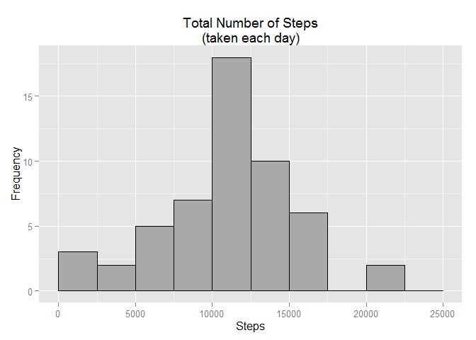
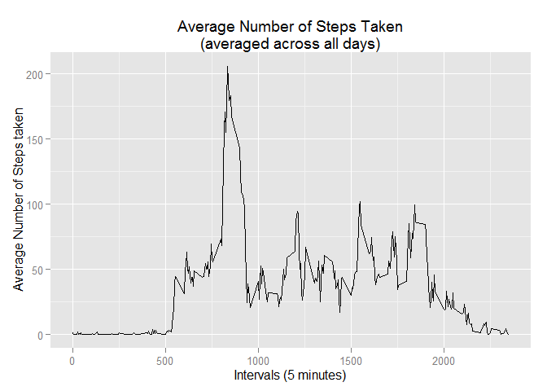
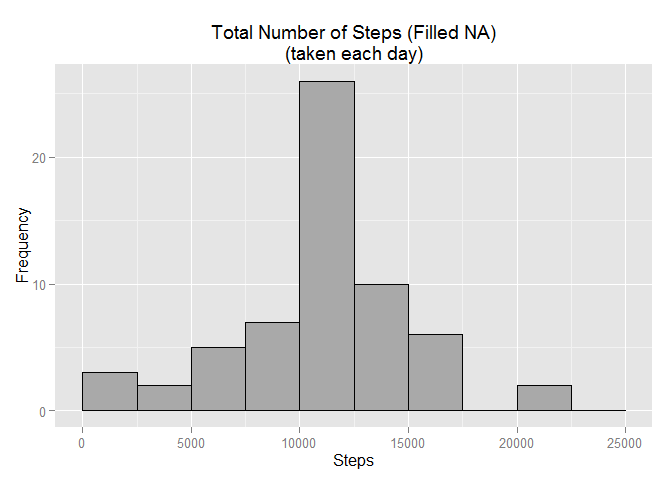
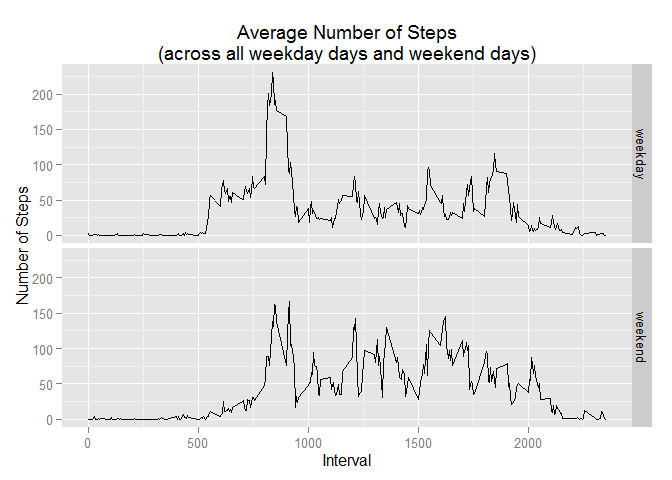

# Reproducible Research: Peer Assessment 1


## Loading and preprocessing the data
##### Download and unzip data file


```r
fileUrl <- "http://d396qusza40orc.cloudfront.net/repdata%2Fdata%2Factivity.zip"
download.file(fileUrl, destfile = "repdata_data_activity.zip")
unzip("repdata_data_activity.zip", overwrite = TRUE)
```

##### Load Activity Monitoring data into R  


```r
activityData <- read.csv("activity.csv")
```

##### Data sample, structure, and summary

```r
head(activityData)
```

```
##   steps       date interval
## 1    NA 2012-10-01        0
## 2    NA 2012-10-01        5
## 3    NA 2012-10-01       10
## 4    NA 2012-10-01       15
## 5    NA 2012-10-01       20
## 6    NA 2012-10-01       25
```

```r
str(activityData)
```

```
## 'data.frame':	17568 obs. of  3 variables:
##  $ steps   : int  NA NA NA NA NA NA NA NA NA NA ...
##  $ date    : Factor w/ 61 levels "2012-10-01","2012-10-02",..: 1 1 1 1 1 1 1 1 1 1 ...
##  $ interval: int  0 5 10 15 20 25 30 35 40 45 ...
```

```r
summary(activityData)
```

```
##      steps                date          interval     
##  Min.   :  0.00   2012-10-01:  288   Min.   :   0.0  
##  1st Qu.:  0.00   2012-10-02:  288   1st Qu.: 588.8  
##  Median :  0.00   2012-10-03:  288   Median :1177.5  
##  Mean   : 37.38   2012-10-04:  288   Mean   :1177.5  
##  3rd Qu.: 12.00   2012-10-05:  288   3rd Qu.:1766.2  
##  Max.   :806.00   2012-10-06:  288   Max.   :2355.0  
##  NA's   :2304     (Other)   :15840
```

##### Change 'Date' format from factor to date

```r
activityData$date <- as.Date(activityData$date, "%Y-%m-%d")
class(activityData$date)
```

```
## [1] "Date"
```

***

## What is mean total number of steps taken per day?

##### Aggregate `activiyData` to get the total number of steps for each date

```r
activityDailyStp <- aggregate(steps ~ date, 
                              data  = activityData, 
                              FUN   = sum, 
                              na.rm = TRUE)
```

##### Plot a histogram of the total number of steps taken each date

```r
library(ggplot2)
ggplot(activityDailyStp, aes(x = steps)) + 
      geom_histogram(binwidth = 2500, colour = "black", fill = "dark gray") +
      xlim(0, 25000) +
      xlab("Steps") + ylab("Frequency") +
      ggtitle("Total Number of Steps\n(taken each day)")
```

 

##### Calculate the mean and median for the total number of steps taken per date


```r
activityDailyMean <- mean(activityDailyStp$steps)
paste("the mean is: ", activityDailyMean)
```

```
## [1] "the mean is:  10766.1886792453"
```

```r
activityDailyMedian <- median(activityDailyStp$steps)
paste("the median is: ", activityDailyMedian)
```

```
## [1] "the median is:  10765"
```

***

## What is the average daily activity pattern?

##### Aggregate `activiyData` to get the total number of steps for interval

```r
activityDailyIntrv <- aggregate(steps ~ interval, 
                                data  = activityData, 
                                FUN   = mean, 
                                na.rm = TRUE)
```

##### Make a time series plot of the 5-minute interval and the average number of steps taken

```r
ggplot(activityDailyIntrv, aes(x = interval, y = steps)) +
      geom_line() + 
      xlab("Intervals (5 minutes)") + 
      ylab("Average Number of Steps taken") +
      ggtitle("Average Number of Steps Taken\n(averaged across all days)")
```

 

##### Get the interval that contains the maximum number of steps

```r
maxSteps <- activityDailyIntrv[which.max(activityDailyIntrv$steps), "interval"]
paste("the interval that contains maximum steps is: ", maxSteps)
```

```
## [1] "the interval that contains maximum steps is:  835"
```

***

## Imputing missing values

##### Calculate and report the total number of missing values in the dataset

```r
numberOfNA <- sum(is.na(activityData$steps))
paste("the total number of NA values is: ", numberOfNA)
```

```
## [1] "the total number of NA values is:  2304"
```

##### Fill all of the missing values in the dataset by the mean for that 5-minute interval,

```r
activityDataFilled <- activityData
for(i in 1:nrow(activityData)){
      if(is.na(activityData[i, "steps"])){
            activityDataFilled[i, "steps"] = activityDailyIntrv[activityDailyIntrv$interval == activityData[i, "interval"], "steps"]
      } 
}

summary(activityDataFilled)
```

```
##      steps             date               interval     
##  Min.   :  0.00   Min.   :2012-10-01   Min.   :   0.0  
##  1st Qu.:  0.00   1st Qu.:2012-10-16   1st Qu.: 588.8  
##  Median :  0.00   Median :2012-10-31   Median :1177.5  
##  Mean   : 37.38   Mean   :2012-10-31   Mean   :1177.5  
##  3rd Qu.: 27.00   3rd Qu.:2012-11-15   3rd Qu.:1766.2  
##  Max.   :806.00   Max.   :2012-11-30   Max.   :2355.0
```

##### Aggregate `activiyDailyFilledStp` to get the total number of steps for each date

```r
activityDailyFilledStp <- aggregate(steps ~ date, 
                              data  = activityDataFilled, 
                              FUN   = sum, na.rm = TRUE)
```

##### Plot a histogram of the total number of steps taken each day for the new dataset


```r
ggplot(activityDailyFilledStp, aes(x = steps)) + 
      geom_histogram(binwidth = 2500, colour = "black", fill = "dark gray") +
      xlim(0, 25000) + xlab("Steps") + ylab("Frequency") +
      ggtitle("Total Number of Steps (Filled NA)\n(taken each day)")
```

 

##### Calculate the mean and median for the new dataset `activityDataFilled`  

```r
activityDailyFilledMean <- mean(activityDailyFilledStp$steps)
paste("the mean is: ", activityDailyFilledMean)
```

```
## [1] "the mean is:  10766.1886792453"
```

```r
activityDailyFilledMedian <- median(activityDailyFilledStp$steps)
paste("the median is: ", activityDailyFilledMedian)
```

```
## [1] "the median is:  10766.1886792453"
```

> There are no significant differences between the mean and median for the two 
> data sets. The only impact that it increases the total number of steps.

***

## Are there differences in activity patterns between weekdays and weekends?

##### Create a new factor variable `day` in the dataset with two levels - "weekday" and "weekend"

```r
for(i in 1:nrow(activityDataFilled)){
      if(weekdays(activityDataFilled[i, "date"]) %in% c("Saturday", "Sunday")){
            activityDataFilled[i, "day"] = "weekend"
      } else {
            activityDataFilled[i, "day"] = "weekday"
      }  
}

activityDataFilled$day <- as.factor(activityDataFilled$day)
```

##### Show structure for the new dataset

```r
str(activityDataFilled)
```

```
## 'data.frame':	17568 obs. of  4 variables:
##  $ steps   : num  1.717 0.3396 0.1321 0.1509 0.0755 ...
##  $ date    : Date, format: "2012-10-01" "2012-10-01" ...
##  $ interval: int  0 5 10 15 20 25 30 35 40 45 ...
##  $ day     : Factor w/ 2 levels "weekday","weekend": 1 1 1 1 1 1 1 1 1 1 ...
```

##### Aggregate `activiyDailyFilledStp` to get the total number of steps for each interval and day

```r
activityDataFilled2 <- aggregate(steps ~ interval + day, 
                                data  = activityDataFilled,
                                FUN   = mean)
```

##### Make a panel plot containing a time series plot of the 5-minute interval and the average number of steps taken, averaged across all weekday days or weekend days

```r
ggplot(activityDataFilled2, aes(x = interval, y = steps)) +
      geom_line() +
      facet_grid(day ~ .) +
      xlab("Interval") +
      ylab("Number of Steps") +
      ggtitle("Average Number of Steps\n(across all weekday days and weekend days)")
```

 

> Average number of steps in weekdays is higher between the 500th and 1000th interval, and between 1000th and 2000th shows higher activity in weekends than weekdays. \n The activity in weekdays start earlier than weekends (between 500th and 750th interval)
